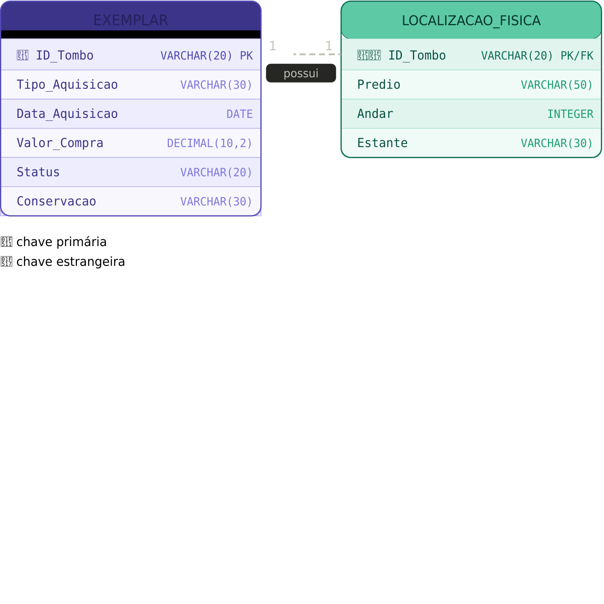

	CREATE TABLE EXEMPLAR ( 
	ID_Tombo VARCHAR(20)   PRIMARY KEY, -- 🔑 PK
	Tipo_Aquisicao VARCHAR(30),
	Data_Aquisicao DATE,
    Valor_Compra DECIMAL(10,2), Status VARCHAR(20),
	Conservacao VARCHAR(30) 
	);
	CREATE TABLE LOCALIZACAO_FISICA ( 
	ID_Tombo VARCHAR(20) PRIMARY KEY -- 🔑🔗 PK e FK 
	REFERENCES EXEMPLAR(ID_Tombo),
	Predio VARCHAR(50),
	Andar INTEGER, Estante VARCHAR(30) 
	);

JUSTIFICATIVA: EXEMPLAR → LOCALIZACAO_FISICA (1:1 via ID_Tombo PK/FK) A localização foi separada em tabela própria para isolar o que é o bem (aquisição, estado) de onde ele está (prédio, andar, estante). 
O padrão chave primaria ID_Tombo sendo PK e FK ao mesmo tempo — garante que toda localização tenha um exemplar correspondente e que cada exemplar tenha no máximo uma localização.
Atributos de aquisição em EXEMPLAR Tipo_Aquisicao, Data_Aquisicao e Valor_Compra descrevem o evento de incorporação do bem, dependendo diretamente do tombo — por isso ficam na tabela principal. Status e Conservacao como VARCHAR simples Valores controlados pela aplicação nesta etapa, sem tabelas de domínio, reduzindo a complexidade inicial do esquema.
