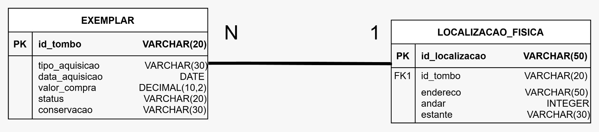

	CREATE TABLE LOCALIZACAO_FISICA (
    id_localizacao VARCHAR(50) PRIMARY KEY,
    endereco VARCHAR(50),
    andar INTEGER,
    estante VARCHAR(30)
	);
	
	CREATE TABLE EXEMPLAR (
    id_tombo VARCHAR(20) PRIMARY KEY,
    tipo_aquisicao VARCHAR(30),
    data_aquisicao DATE,
    valor_compra DECIMAL(10,2),
    status VARCHAR(20),
    conservacao VARCHAR(30),
    id_localizacao VARCHAR(50),

    FOREIGN KEY (id_localizacao)
        REFERENCES LOCALIZACAO_FISICA(id_localizacao)
	);

Justificativa do relacionamento

O relacionamento entre EXEMPLAR e LOCALIZACAO_FISICA foi modelado como N:1, onde vários exemplares podem compartilhar uma mesma localização física. Essa abordagem representa melhor o funcionamento real de uma biblioteca, já que diversos exemplares podem estar armazenados na mesma estante, corredor ou andar. Por esse motivo, a chave estrangeira id_localizacao foi inserida na tabela EXEMPLAR, indicando a localização associada a cada exemplar. A entidade LOCALIZACAO_FISICA foi mantida separada para evitar redundância de dados e facilitar futuras alterações ou reutilizações de locais cadastrados.
