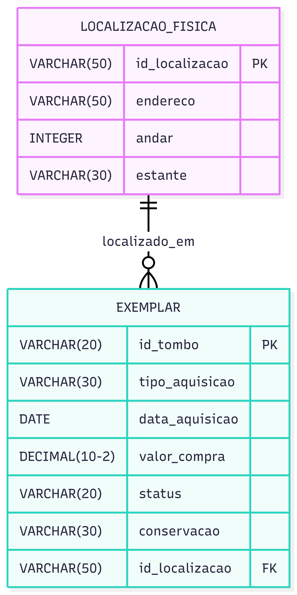

    =============================================
    1. TABELA LOCALIZACAO_FISICA
    =============================================
    CREATE TABLE localizacao_fisica (
        id_localizacao     VARCHAR(50)   PRIMARY KEY,
        endereco           VARCHAR(50)   NOT NULL,
        andar              INTEGER,
        estante            VARCHAR(30),
    
        CONSTRAINT ck_andar_positivo CHECK (andar >= 0)
    );

    =============================================
    2. TABELA EXEMPLAR
    =============================================
    CREATE TABLE exemplar (
        id_tombo           VARCHAR(20)    PRIMARY KEY,
        tipo_aquisicao     VARCHAR(30),
        data_aquisicao     DATE,
        valor_compra       DECIMAL(10,2)  DEFAULT 0.00,
        status             VARCHAR(20)    DEFAULT 'Disponível',
        conservacao        VARCHAR(30),
        id_localizacao     VARCHAR(50)    NOT NULL,
    
        CONSTRAINT fk_exemplar_localizacao 
            FOREIGN KEY (id_localizacao) 
            REFERENCES localizacao_fisica(id_localizacao)
            ON DELETE RESTRICT 
            ON UPDATE CASCADE
    );

